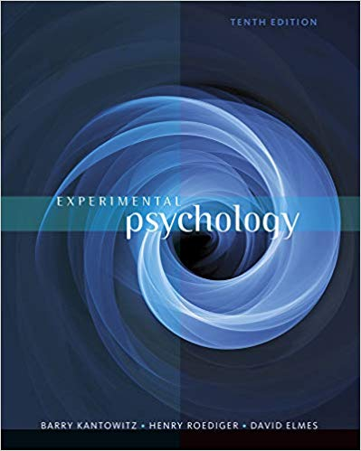

# 1. Time and Location

- Time: 14:00 - 18:00, Thuesday

- Location: Room 512, Main Building South

- Lecturer: Likan Zhan

# 2. Course Information

A brief of the experimental methods used in psychology.

# 3. Textbook

- Barry H. Kantowitz, B. H., Roediger, H. L. III, & Elmes, D. G. (2015). Experimental Psychology (10 ed.). Cengage Learning

# 4. Syllabus and Lecture Notes

- Part I. Foundations of Research
    - Chapter 01. Introduction. [<i class="fa fa-file-pdf-o"></i>](https://appendix.likan.info/Experimental-Psychology/CH-01.pdf)
    - Chapter 02. Variables Used in Experimental Psychology. [<i class="fa fa-file-pdf-o"></i>](https://appendix.likan.info/Experimental-Psychology/CH-02.pdf)
    - Chapter 03. Research Techniques: Experiments, Observation and Correlation.
    - Chapter 04. Ethics in Psychological Research
    - Chapter 05. How to Read and Write Research Reports

- Part II. Principles and Practices of Experimental Psychology
    - Chapter 06. Psychophysics
    - Chapter 07. Perception
    - Chapter 08. Attention and Reaction Time
    - Chapter 09. Conditioning and Learning
    - Chapter 10. Remembering and Forgetting
    - Chapter 11. Thinking and Problem Solving
    - Chapter 12. Individual Differences and Development
    - Chapter 13. Social Psychology
    - Chapter 14. Environmental Psychology
    - Chapter 15. Human Factors

# 5. Examination

To Be Added
