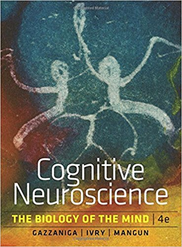

# 1. Time and Location

- Time: 0800 - 1000, Each Monday

- Location: Room 507, Main Building South

- Lecturer: Likan Zhan

# 2. Course Information

 Cognition is acquisition, storage, transformation, and use of knowledge. Neuroscience is the study of the structure and workings of the nervous system. Cognitive neuroscience, then, is the study of how cognitive processes can be explained by the structure and function of the brain. This course briefly introduces the structure and function of the nervous system, the techniques used to study the nervous systems, and the main cognitive functions supported by the nervous system, such as Sensation and Perception, Object Recognition, Attention, Action, Memory, Emotion, Language, Cognitive Control, Social Cognition etc.

# 3. Textbook

- Gazzaniga, M. S., Ivry, R. B., & Mangun, G. R. (2014). *[Cognitive neuroscience: The biology of the mind](https://www.amazon.com/Cognitive-Neuroscience-Biology-Mind-4th/dp/0393913481/ref=sr_1_1?s=books&ie=UTF8&qid=1489241498&sr=1-1&keywords=Cognitive+neuroscience%3A+The+biology+of+the+mind)* (4 ed.). New York, NY: Norton

# 4. Lecture Notes

- Part I. Background and methods
  - Chapter 00. Introduction to the Course. [<i class="fa fa-file-pdf-o"></i>](https://appendix.likan.info/Introduction-to-Cognitive-Neuroscience/CH.01.pdf)
  - Chapter 01. A Brief History of Cognitive Neuroscience. [<i class="fa fa-file-pdf-o"></i>](https://appendix.likan.info/Introduction-to-Cognitive-Neuroscience/CH.01.pdf)
  - Chapter 02. Structure and Function of the Nervous System. [<i class="fa fa-file-pdf-o"></i>](https://pan.baidu.com/s/1EJezK9NoLhnYFZy1fvJFNQ) PassWord: ajey
  - Chapter 03. Methods of Cognitive Neuroscience.
- Part II. Core Processes
  - Chapter 04. Hemispheric Specialization.
  - Chapter 05. Sensation and Perception.
  - Chapter 06. Object Recognition.
  - Chapter 07. Attention.
  - Chapter 08. Action. 
  - Chapter 09. Memory.
  - Chapter 10. Emotion.
  - Chapter 11. Language.
- Part III. Control Processes
  - Chapter 12. Cognitive Control.
  - Chapter 13. Social Cognition.
  - Chapter 14. Consciousness, Free Will, and the Law.

# 4. Grading

- Oral Presentation: 50 %
  - See the [syllabus](#presenters) part for the oral presentation groups;
  - Submit your [Scores](https://likan.typeform.com/to/utLhPS);
- Reading Report: 50 %
 - Your will write a reading report of an academic article.
 - The article you read should
     - be written in English;
     - be an appropriate article for the course;
     - be published in the last five years, i.e., 2014 - 2018;
     - be an original research article, not a review article;
     - be NOT related to language.
 - The report you submitted should
     - be written in Chinese;
     - be about 3000 words in length (Chinese Charaters);
     - consist of two main parts:
         - background, methods, and main findings of the article ( about 2000 - 2500 words);
         - future directions of this topic (500 - 1000 words).
